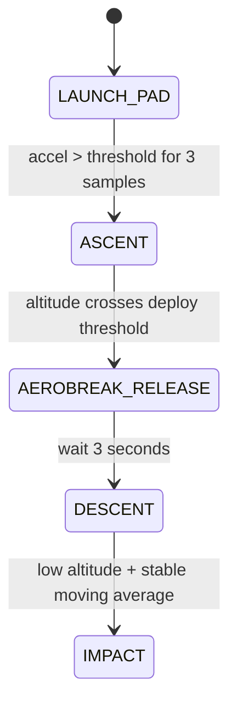
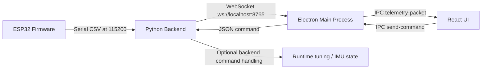

# CanSat Firmware and Ground Station Communication Guide

This guide explains how the embedded firmware works, what each important function does, how data moves through the firmware, and how the ground station connects to it.

The guide is anchored to the embedded project in [cansat-firmware](cansat-firmware) and the desktop ground-station project in [inspace-GS](inspace-GS).

## 1. System Overview

The overall workflow is:

1. The ESP32 firmware reads sensors and builds a telemetry packet.
2. The firmware emits telemetry over the serial link.
3. The Python ground-station backend reads the telemetry stream, validates and enriches it, and republishes it over WebSocket.
4. The Electron application listens to the WebSocket feed and forwards packets to the renderer UI.
5. The renderer shows live telemetry, mission state, charts, and logs.

## 2. Firmware Architecture

The firmware is split into three main layers:

- Hardware access: sensor initialisation and periodic sensor reads.
- Mission logic: state machine, launch detection, descent handling, and simulation support.
- Telemetry and command handling: CSV packet formatting and serial command parsing.

### Firmware Flowchart

```mermaid
flowchart TD
  A[Boot / setup()] --> B[sensorManagerInit()]
  B --> C[loop()]
  C --> D[sensorManagerUpdate()]
  D --> E{Serial command received?}
  E -->|Yes| F[parseCommand()]
  E -->|No| G[Continue]
  F --> H[readEffectiveAltitude()]
  G --> H
  H --> I[updateStateMachine()]
  I --> J{Telemetry interval reached?}
  J -->|Yes| K[formatTelemetryCSV()]
  K --> L[Serial.println(csv)]
  J -->|No| C
  L --> C
```

### Flight State Flow



## 3. Core Files and Their Responsibilities

### [cansat-firmware/include/config.h](cansat-firmware/include/config.h)

This file centralises hardware pins, thresholds, and telemetry constants.

Important values:

- I2C pins: `PIN_I2C_SDA = 21`, `PIN_I2C_SCL = 22`
- BNO055 address: `0x28`
- BMP390 address: `0x77`
- GPS UART2 pins: `PIN_GPS_RX = 16`, `PIN_GPS_TX = 17`
- Telemetry baud: `115200`
- Telemetry rate: `1 Hz`
- Launch acceleration threshold: `15.0 m/s²`
- Aerobreak deploy altitude: `600 m`
- Landing altitude: `5 m`
- MiCS preheat time: `180000 ms`

### [cansat-firmware/include/sensor_manager.h](cansat-firmware/include/sensor_manager.h)

Defines the shared `SensorData` structure and the sensor manager interface.

The structure holds:

- IMU readings: pitch, roll, yaw, accelerations, calibration state
- Barometric data: pressure, temperature, altitude, BMP readiness
- Momentum wheel data: gyro RPM and spin rate
- Particulate sensor data: PM1.0, PM2.5, PM4.0, PM10
- CO2 / humidity / temperature from SCD41
- Gas sensor resistances from MiCS-4514 and MQ-135
- GPS position, altitude, satellite count, fix quality
- A mutex so reads and writes can be safely shared across tasks or code paths

### [cansat-firmware/include/telemetry.h](cansat-firmware/include/telemetry.h)

Declares the telemetry formatter.

- `formatTelemetryCSV(const SensorData&, uint8_t, bool, const char*)` is the embedded formatter used on the device.
- In `NATIVE_TEST` builds, a legacy string-returning overload is kept for desktop testing.

### [cansat-firmware/include/firmware.h](cansat-firmware/include/firmware.h)

Exposes the flight state and a few globals needed by tests or other translation units.

Key items:

- `FlightState` enum: `BOOT`, `TEST_MODE`, `LAUNCH_PAD`, `ASCENT`, `ROCKET_DEPLOY`, `DESCENT`, `AEROBREAK_RELEASE`, `IMPACT`
- Global mission counters: `packetCount`, `missionTimeSec`
- `currentState` and `altitudeGroundOffset`
- `evaluateStateMachine(float effectiveAltitude)` for test and control logic

## 4. Function Reference

### [cansat-firmware/src/sensor_manager.cpp](cansat-firmware/src/sensor_manager.cpp)

#### `hallISR()`

Interrupt service routine for the hall sensor.

How it works:

- Runs on every rising edge from the hall sensor input.
- Increments a volatile pulse counter.
- The counter is later converted into RPM and degrees per second.

#### `adcToResistanceOhm(int raw)`

Converts a raw ADC reading into a sensor resistance estimate.

How it works:

- Converts the 12-bit ADC count to voltage.
- Applies the resistor-divider equation.
- Returns a very large fallback value if the reading is near 0 V or full-scale.

#### `sensorManagerInit()`

Initialises all attached sensors and GPIOs.

What it does:

- Creates the FreeRTOS mutex for `g_sensors`.
- Starts the I2C bus.
- Initialises the BNO055 IMU and enables the external crystal.
- Initialises the BMP390 and configures oversampling, filtering, and output rate.
- Configures the hall sensor interrupt for the momentum wheel.
- Starts the SPS30 particulate sensor.
- Starts the SCD41 CO2 sensor in low-power periodic mode.
- Turns on the MiCS heater and starts the preheat timer.
- Configures the gas-sensor and MQ-135 analog inputs.
- Starts GPS serial on UART2 at 9600 baud.

#### `sensorManagerUpdate()`

Reads all sensors and refreshes the shared `g_sensors` snapshot.

How it works:

- Takes the mutex before writing shared state.
- Reads Euler angles and linear acceleration from the BNO055.
- Reads calibration status and marks the IMU calibrated when system calibration reaches 3.
- Reads pressure, temperature, and altitude from the BMP390 when it is ready.
- Converts hall pulses to RPM and degrees per second once per second.
- Reads particulate values from the SPS30 if available.
- Reads CO2, temperature, and humidity from the SCD41 when data is ready.
- Keeps MiCS readings at `-1` until the heater has preheated for the required time.
- Converts MQ-135 resistance into a rough AQI proxy.
- Feeds GPS bytes from UART2 into TinyGPSPlus and updates location fields if a fix is valid.

### [cansat-firmware/src/telemetry.cpp](cansat-firmware/src/telemetry.cpp)

#### `formatTelemetryCSV(const SensorData&, uint8_t, bool, const char*)`

Formats a single telemetry line for transmission.

How it works:

- Converts the flight mode into `F` or `S` depending on whether simulation is active.
- Builds the optional payload string with particulate, CO2, gas, AQI, humidity, SCD temperature, IMU attitude, calibration flag, and GPS fix quality.
- Writes the final comma-separated line into a static buffer.
- Returns a pointer to that buffer so the caller can print it directly.

### [cansat-firmware/src/main.cpp](cansat-firmware/src/main.cpp)

#### `updateStateMachine(FlightState current, const SensorData& s)`

Implements the main flight state transitions.

How it works:

- In `LAUNCH_PAD`, it waits for acceleration above the launch threshold for 3 consecutive samples.
- In `ASCENT`, it watches altitude to detect the transition toward chute or aerobreak deployment.
- In `AEROBREAK_RELEASE`, it waits 3 seconds before moving into descent.
- In `DESCENT`, it collects a short altitude history buffer and checks whether the altitude is both low and stable.
- In `IMPACT`, it stops transitioning.

This is the control logic that decides the current mission phase.

#### `evaluateStateMachine(float effectiveAltitude)`

Thin wrapper used by tests and external code.

How it works:

- Updates `currentState` by calling the internal transition function.
- Uses the global sensor snapshot that is already populated by `sensorManagerUpdate()`.

#### `readEffectiveAltitude()`

Returns the altitude value used by the firmware at runtime.

How it works:

- If simulation mode is active, returns the simulated altitude.
- Otherwise, subtracts the ground offset from the barometric altitude.
- Uses the mutex so the altitude read is consistent with the sensor update.

#### `parseCommand(String line)`

Parses serial commands coming from the ground station or a serial console.

Supported commands:

- `CMD,ARM` or `CMD,START_TX`: enables telemetry transmission
- `CMD,STOP_TX`: disables telemetry transmission
- `CMD,CAL`: zeroes the barometric altitude against the current reading
- `CMD,SIM_ENABLE`: enables simulation mode
- `CMD,SIM_ACTIVATE`: starts simulation playback after simulation has been enabled
- `CMD,SIMP,<pressure_pa>`: injects a simulated pressure value and converts it to altitude

How it works:

- Trims whitespace.
- Converts the command to uppercase.
- Updates the matching control flag or calibration value.
- Logs a short serial message for operator feedback.

#### `setup()`

Runs once at boot.

How it works:

- Starts the serial telemetry link at `TELEMETRY_BAUD`.
- Initialises all sensors.
- Sets the initial state to `LAUNCH_PAD`.
- Starts the telemetry timer reference.
- Prints a boot message to the serial console.

#### `loop()`

Main runtime loop.

How it works:

- Updates all sensors.
- Reads any waiting command line from serial and dispatches it to `parseCommand()`.
- Computes the effective altitude.
- Updates the flight state machine.
- When the telemetry interval elapses, increments the packet counter, formats the CSV, and transmits it if TX is enabled.

### [cansat-firmware/src/main_native.cpp](cansat-firmware/src/main_native.cpp)

This file is the desktop/native test implementation.

Why it exists:

- It lets the firmware logic be tested on a normal computer.
- It reuses the same public headers and mirrors the embedded interfaces.
- It provides a test-only `formatTelemetryCSV()` overload and a simplified state machine for unit tests.

## 5. How the Firmware Works End-to-End

1. Boot starts `setup()`.
2. `sensorManagerInit()` brings up all sensors and buses.
3. `loop()` continuously refreshes `g_sensors`.
4. The firmware consumes incoming serial commands from the ground station.
5. The mission state machine tracks launch, ascent, deployment, descent, and impact.
6. At the configured rate, the firmware formats a telemetry line and prints it over serial.

## 6. Communication Links and Endpoints

### On the Firmware Side

These are the physical and logical connections used by the embedded code:

- I2C bus for BNO055 and BMP390 on SDA 21 / SCL 22
- UART2 GPS on RX 16 / TX 17 at 9600 baud
- Serial telemetry link over the USB/UART channel at 115200 baud
- Hall sensor interrupt input for wheel speed calculation
- Analog inputs for MiCS-4514 and MQ-135 gas sensing

### Serial Commands Sent to the Firmware

These are the command strings the firmware currently understands:

- `CMD,ARM`
- `CMD,START_TX`
- `CMD,STOP_TX`
- `CMD,CAL`
- `CMD,SIM_ENABLE`
- `CMD,SIM_ACTIVATE`
- `CMD,SIMP,<pressure_pa>`

### Ground Station Network Endpoints

The desktop ground station uses a layered communication path:

- Python backend WebSocket server: `ws://localhost:8765`
- Python backend serial input: configured by `PORT` and `BAUD` in [inspace-GS/backend/config.py](inspace-GS/backend/config.py)
- Electron renderer-to-main IPC channels:
  - `telemetry-packet`
  - `telemetry-status`
  - `connection-status`
  - `send-command`
  - `export-csv`
  - `get-port-list`
  - `connect-port`

### Ground Station Command Messages

The Python backend accepts JSON command payloads from Electron and handles these command types:

- `RECALIBRATE_IMU`
- `SET_FILTER_ALPHA`
- `SET_IK_GAINS`
- `ARM_AUTOGYRO`
- `DISARM_AUTOGYRO`

## 7. Communication Flow with the Ground Station



## 8. Ground Station Behaviour Relevant to the Firmware

The ground station repository contains two transport behaviors:

- WebSocket telemetry from the Python backend into Electron.
- Serial fallback in Electron when the WebSocket path is not available.

This means the firmware itself does not need to speak WebSocket directly. In the current design, it only needs to output the expected serial telemetry format and accept the serial command strings above.

## 9. Important Compatibility Note

The workspace contains more than one telemetry schema.

- The firmware in [cansat-firmware](cansat-firmware) emits the compact CSV defined in its own README and `telemetry.cpp`.
- The ground-station backend in [inspace-GS](inspace-GS) also has a richer packet model and a serial parser that expects a different field layout.

If you want a direct live link from this firmware to the desktop app, the telemetry schema on both sides must match exactly, or a translation layer must be used.

## 10. Summary

The firmware is responsible for three things only:

- reading and updating sensor state,
- tracking the flight phase,
- sending telemetry and consuming control commands.

The ground station then handles transport, parsing, logging, command forwarding, and the visual UI.
