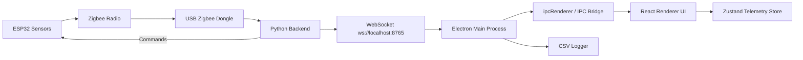
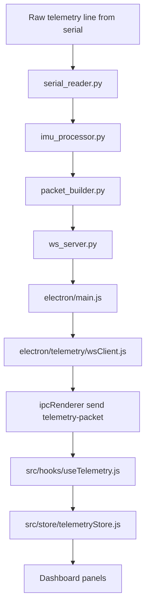
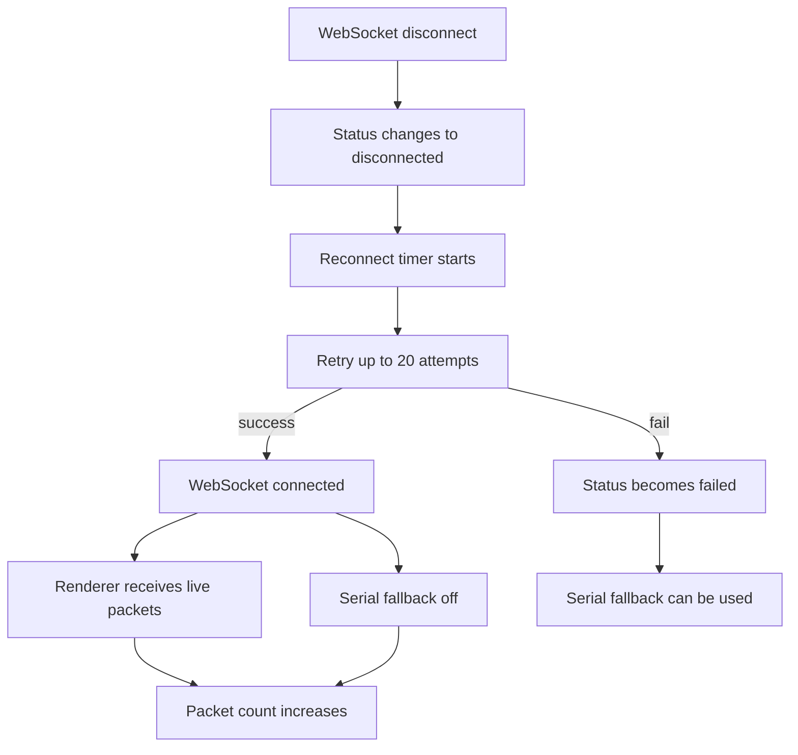
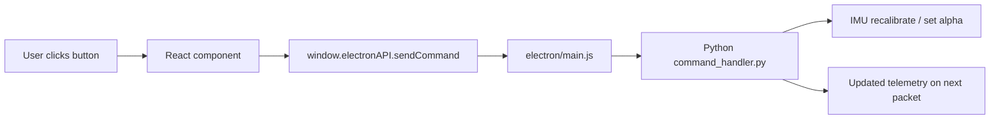

# INSpace CanSat GS - Architecture and Implementation

This document explains what is implemented in the app, how the pieces connect, and how telemetry moves through the system.

## 1. High-level purpose
INSpace CanSat GS is a desktop ground-station application for the INSpace CanSat competition.
It receives telemetry from the CanSat hardware, processes it, logs it, and displays it live in a competition-style dashboard.

## 2. What is implemented
### Electron main process
- Connects to the Python backend over WebSocket
- Sends telemetry packets to the renderer over IPC
- Falls back to serial if WebSocket telemetry is unavailable
- Logs each packet to CSV
- Exposes IPC handlers for CSV export and serial port actions

### Python backend
- Reads raw UART telemetry from the ESP32/Zigbee path
- Parses raw CSV lines into structured telemetry packets
- Applies complementary filtering and drift tracking
- Computes derived values such as descent rate and distance from pad
- Broadcasts telemetry packets over WebSocket on port 8765
- Accepts commands from the desktop app

### React renderer
- Shows the live dashboard panels
- Renders the artificial horizon on Canvas 2D
- Renders the altitude chart using Recharts
- Renders the GPS map using react-leaflet
- Displays the telemetry log and system health panels
- Reads packet data from the Zustand store

### State management
- Zustand stores the latest telemetry packet
- Keeps a rolling history of recent packets
- Tracks connection status, packet loss, apogee, and mission timing
- Provides derived selector data for charts and map trails

## 3. Main architecture

## 4. Telemetry flow

## 5. Connection and recovery flow

## 6. Packet normalisation and validation
The WebSocket client includes a defensive normaliser.
It does the following:
- Converts snake_case to camelCase
- Adds missing top-level packet sections with safe defaults
- Clamps critical numeric ranges
- Stores the last validated packet for export or debugging

This protects the renderer from malformed or partially missing backend data.

## 7. Python backend processing
The backend is split into small modules:
- `serial_reader.py` reads UART data and emits raw CSV lines
- `imu_processor.py` computes complementary-filter output and drift estimates
- `gps_utils.py` provides haversine distance and GPS fix mapping
- `packet_builder.py` converts the raw CSV fields into the final telemetry schema
- `command_handler.py` handles commands such as recalibration and gain updates
- `ws_server.py` broadcasts telemetry to Electron clients
- `main.py` coordinates the event loop and startup

## 8. React UI implementation
The renderer is split into panels so each major subsystem is visible at once.

### Orientation panel
- Uses Canvas 2D for a live artificial horizon
- Displays raw and compensated pitch/roll values side by side
- Uses requestAnimationFrame for smooth redraws

### Autogyro panel
- Shows stability state, rotor RPM, servo positions, and IK math
- Displays the predicted servo outputs alongside the reported values
- Lets the operator tune Kp and Kd in the UI

### Altitude panel
- Shows the large live altitude number
- Shows a chart of barometric and GPS altitude history
- Marks apogee on the graph

### GPS panel
- Shows a live Leaflet map
- Displays launch pad and current CanSat markers
- Draws the flight trail from packet history

### Environmental panel
- Shows temperature, pressure, humidity, and battery cards

### System health panel
- Shows battery, signal, and GPS fix quality bars
- Shows mission phase and drift status

### Telemetry log
- Shows packet-by-packet text output
- Uses monospace formatting
- Can be paused while keeping data history in state

## 9. Command flow

Commands implemented include:
- recalibrate IMU
- set complementary filter alpha
- set IK gains
- arm or disarm autogyro

## 10. CSV logging
Every validated packet is written to a dated CSV file in the user data logs folder.
That supports post-flight analysis and judge review.

## 11. Runtime modes
- Live mode: backend talks to real hardware through serial
- Mock mode: backend generates realistic telemetry for UI testing
- WebSocket reconnect mode: Electron retries the Python backend if the link drops

## 12. Why the app is structured this way
The architecture separates concerns cleanly:
- Python handles hardware I/O and packet building
- Electron handles desktop runtime and IPC
- React handles the operator-facing display
- Zustand keeps the UI synchronized with the live stream

This makes the system easier to test, easier to debug, and safer to operate during a competition run.
